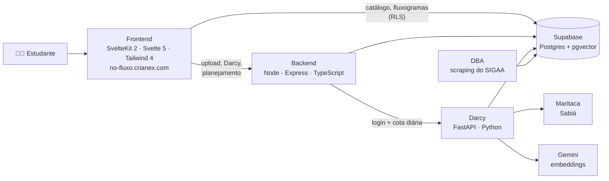

<div align="center">

<a href="https://no-fluxo.crianex.com">
  <picture>
    <source media="(prefers-color-scheme: dark)" srcset="assets/readme/banner-dark.svg">
    
  </picture>
</a>

<br/>

[](https://github.com/unb-mds/2025-1-NoFluxoUnB/actions/workflows/pipelineCI.yml)
[](https://github.com/unb-mds/2025-1-NoFluxoUnB/actions/workflows/deploy.yml)
[](./LICENSE)
[](https://github.com/unb-mds/2025-1-NoFluxoUnB/commits/main)
[](https://github.com/unb-mds/2025-1-NoFluxoUnB/graphs/contributors)
[](https://github.com/unb-mds/2025-1-NoFluxoUnB/stargazers)

**[🌐 Acessar o NoFluxo](https://no-fluxo.crianex.com)** ·
**[📖 Documentação](https://unb-mds.github.io/2025-1-NoFluxoUnB/)** ·
**[📋 Board](https://github.com/orgs/unb-mds/projects/29)** ·
**[🎨 Protótipo](https://www.figma.com/design/uy5ZwJGkuzjRaeREouMSlI/-arquivado--Prototipo-e-IDV-No-FLX-UnB?node-id=0-1&p=f&t=wMKM19zNX9jK3v7F-0)** ·
**[🤝 Contribuir](./CONTRIBUTING.md)**

</div>

---

## ✨ O que é

O **NoFluxo UnB** é o fluxograma acadêmico interativo da Universidade de Brasília. O estudante envia o histórico do SIGAA e vê, em segundos, onde está no curso: o que já cumpriu, o que pode cursar agora, o que está travado por pré-requisito e quanto falta para formar — com um assistente de IA, o **Darcy**, para ajudar a escolher optativas e montar o plano.

Nasceu como projeto do Squad 03 em Métodos de Desenvolvimento de Software (MDS 2025/1, FGA/UnB) e hoje é um produto da **[Crianex](https://crianex.com)**, mantido por parte do time original.

<div align="center">
  <picture>
    <source media="(prefers-color-scheme: dark)" srcset="assets/readme/home-dark.jpg">
    
  </picture>
</div>

## 🧭 Funcionalidades

| | |
|---|---|
| 🗺️ **Fluxograma interativo** | Todos os cursos da UnB, por matriz e turno. Cadeia de pré-requisitos ao passar o mouse, equivalências, optativas e módulo livre, zoom legível na abertura e modo tela cheia. |
| 📄 **Histórico do SIGAA** | Envie o PDF e o fluxograma se pinta sozinho: aprovadas, matriculadas, disponíveis, reprovadas e bloqueadas. PDFs que não são histórico são recusados com aviso claro. |
| 📊 **Integralização** | Percentual honesto por natureza (obrigatórias, optativas, módulo livre), horas que faltam e IRA. |
| 🎓 **Plano de Formatura** | Previsão semestre a semestre até a formatura, com limite de créditos e sugestões de optativas. |
| 🧩 **Montador de Grade** | Monta a grade do próximo semestre com as turmas ofertadas. |
| 🤖 **Darcy (IA)** | Recomenda optativas pelos seus interesses a partir das ementas. Exclusivo para quem está logado, com cota diária gratuita e rastreamento de custo no painel de administração. |
| 🌗 **Modo claro e escuro** | Os dois temas seguem o mesmo design system, com contraste medido em testes. |
| ♿ **Acessibilidade** | Alto contraste, texto ampliado, fonte de leitura facilitada (Lexend), reduzir movimento e foco reforçado — no desktop e no celular. |

<div align="center">
  
  <br/>
  <sub>Fluxograma de Engenharia de Software nos temas escuro e claro.</sub>
</div>

<br/>

<table align="center">
  <tr>
    <td align="center" valign="top" width="26%">
      <br/>
      <sub>Acessibilidade sempre à mão no celular.</sub>
    </td>
    <td align="center" valign="top">
      <picture>
        <source media="(prefers-color-scheme: dark)" srcset="assets/readme/crianex-dark.jpg">
        
      </picture><br/>
      <sub>Um produto <code>/cria._nex&gt;</code>.</sub>
    </td>
  </tr>
</table>

## 🎨 Design system

Dois temas — **escuro** (padrão) e **claro** (paleta B) — sobre os mesmos tokens HSL. Nada pinta a tela com cor fixa: componentes usam os tokens de `frontend/src/app.css` (`:root` = claro, `.dark` = escuro) via Tailwind 4 e shadcn-svelte.

| Token | Claro | Escuro | Uso |
|---|---|---|---|
| `--primary` |  |  | Ações principais, destaques, "UNB" da logo |
| `--ai` |  |  | Darcy e elementos de IA |
| `--background` |  |  | Fundo da página |
| `--foreground` |  |  | Texto |
| `--crianex` |  |  | Marca Crianex |

**Status das disciplinas** — mesmas cores na faixa do card, na legenda e nas conexões:

    

**Tipografia** — Inter (interface) · Permanent Marker (logo NOFLX) · Rock Salt (mote) · Lexend (fonte de leitura) · JetBrains Mono (códigos e marca Crianex).

**Regras** — texto ≥ 4,5:1 e elementos gráficos ≥ 3:1 nos dois temas, medidos sobre o fundo real da página por testes automatizados (`frontend/src/lib/styles/contraste.ts`); toda tela nova nasce em claro e escuro; animações respeitam `prefers-reduced-motion`. Guia completo em [`docs/design-system.md`](./docs/design-system.md).

## 🏗️ Arquitetura



Os três serviços (frontend, backend e Darcy) rodam em contêineres num cluster K3s da Crianex. O deploy só acontece com o CI verde e só termina quando cada serviço responde, no endereço público, com o commit publicado.

## 🛡️ Qualidade e segurança

- **CI** (GitHub Actions, filtrado por área): Vitest e axe/Playwright no frontend, Jest no backend, Pytest + Black + Flake8 no Python, `npm audit` e Code Quality.
- **Deploy verificado**: workflow espera o rollout e confere o commit em `/health` de cada serviço.
- **Dependências**: Dependabot com atualizações de segurança automáticas.
- **Pré-mortem** (set/2026): riscos levantados com a pergunta *"6 meses depois o NoFluxo falhou — por quê?"*, provados por teste e corrigidos em PRs com regressão.
- **Dados**: RLS no catálogo, IA paga só para usuários logados, segredos só por variável de ambiente.

## 💻 Rodando localmente

```bash
# 1. Ambiente (venv Python + dependências Node)
python scripts/setup_env.py --node

# 2. Frontend — http://localhost:5173
cd frontend && npm run dev

# 3. Backend — porta 3325 com o .env.example (dev:full sobe também o Darcy)
cd backend && npm run dev

# 4. Testes
cd frontend && npm run test:unit
cd backend && npm test
cd DBA/tests && python -m pytest
```

Variáveis de ambiente, Supabase local e solução de problemas: [CONTRIBUTING.md](./CONTRIBUTING.md).

| Pasta | O que é |
|---|---|
| `frontend/` | SvelteKit 2 + Svelte 5 (runes) + Tailwind 4, SPA estática |
| `backend/` | API Node/TypeScript + Express |
| `mcp_agent/` | Darcy: FastAPI + Maritaca + Gemini + pgvector |
| `DBA/` | Scraping do SIGAA, ingestão no Supabase, parser de PDF |
| `supabase/migrations/` | SQL do banco |
| `docs/` | Specs técnicas internas (design system, motores, investigações) |
| `documentacao/` | Site público MkDocs (atas, requisitos, testes) |
| `kubernetes_docs/` | Infra: cluster, registry e deploy |

## 👥 Equipe

### Time atual

<table align="center">
  <tr>
    <td align="center"><br/><b>Vitor Marconi</b><br/><sub>CEO · Crianex<br/>dev e mantenedor</sub><br/><a href="https://github.com/Vitor-Trancoso">@Vitor-Trancoso</a></td>
    <td align="center"><br/><b>Rodrigo Bessone</b><br/><sub>CMO · Crianex<br/>direção criativa e comercial</sub><br/><a href="https://www.instagram.com/besssone">@besssone</a></td>
    <td align="center"><br/><b>Felipe Pedroza</b><br/><sub>mantenedor</sub><br/><a href="https://github.com/darkymeubem">@darkymeubem</a></td>
    <td align="center"><br/><b>Gustavo Choueiri</b><br/><sub>mantenedor</sub><br/><a href="https://github.com/staann">@staann</a></td>
    <td align="center"><br/><b>Arthur Fernandes</b><br/><sub>mantenedor</sub><br/><a href="https://github.com/hisarxt">@hisarxt</a></td>
  </tr>
</table>

### Fundadores — Squad 03 · MDS 2025/1 · FGA/UnB

<table align="center">
  <tr>
    <td align="center"><br/><sub><b>Arthur Ramalho</b></sub></td>
    <td align="center"><br/><sub><b>Arthur Fernandes</b></sub></td>
    <td align="center"><br/><sub><b>Erick Alves</b></sub></td>
    <td align="center"><br/><sub><b>Felipe Pedroza</b></sub></td>
    <td align="center"><br/><sub><b>Guilherme Gusmão</b></sub></td>
  </tr>
  <tr>
    <td align="center"><br/><sub><b>Gustavo Choueiri</b></sub></td>
    <td align="center"><br/><sub><b>Otavio Maya</b></sub></td>
    <td align="center"><br/><sub><b>Vinícius Pereira</b></sub></td>
    <td align="center"><br/><sub><b>Vitor Marconi</b></sub></td>
    <td></td>
  </tr>
</table>

---

<div align="center">
  <sub>Código aberto sob a licença <a href="./LICENSE">GPL-3.0</a> · Um produto <a href="https://crianex.com"><code>/cria._nex&gt;</code></a></sub>
</div>
