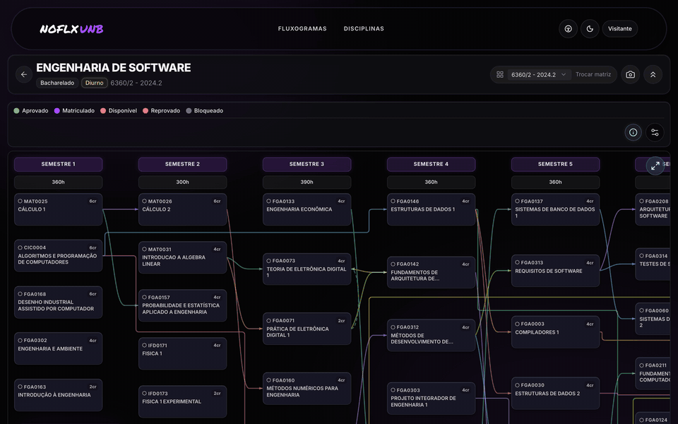
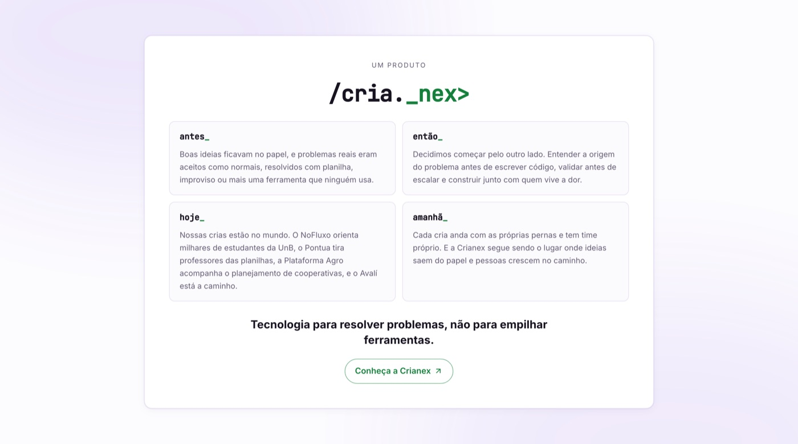

<a href="https://no-fluxo.crianex.com">
  <picture>
    <source media="(prefers-color-scheme: dark)" srcset="assets/readme/banner-dark.svg">
    
  </picture>
</a>

 

### Seu curso inteiro num mapa só. Saiba o que cursar agora e quanto falta para formar.

 

Funciona no computador e no celular · sem instalar nada · para todos os cursos da UnB

---

## Planejar o curso não deveria ser um quebra-cabeça

Pré-requisito que trava tudo, equivalência que ninguém explica, optativa que você não sabe se conta, aquele "quanto falta mesmo?" a cada matrícula. O **NoFluxo** junta tudo isso num fluxograma interativo do **seu** curso, montado a partir do **seu** histórico.

  <picture>
    <source media="(prefers-color-scheme: dark)" srcset="assets/readme/home-dark.jpg">
    
  </picture>

## Como funciona

| 1️⃣ Escolha seu curso | 2️⃣ Envie seu histórico | 3️⃣ Planeje com clareza |
|:---:|:---:|:---:|
| Todos os cursos da UnB, por matriz e turno. Dá para explorar sem criar conta. | Mande o PDF do SIGAA e o fluxograma se pinta sozinho: o que você já fez, o que pode cursar e o que ainda está travado. | Monte a previsão de formatura e a grade do próximo semestre, com sugestões feitas para você. |

  
   
  Passe o mouse numa matéria e veja o caminho até ela e tudo o que ela libera — no tema escuro ou claro.

## O que você ganha

- 🗺️ **Clareza na hora da matrícula** — veja de uma vez o que já está liberado e o que cada matéria destrava.
- 🔗 **Equivalências e optativas sem dor de cabeça** — o que você já cursou aparece reconhecido, inclusive módulo livre.
- 📊 **Quanto falta, de verdade** — percentual honesto por tipo de disciplina e as horas que ainda faltam.
- 🎓 **Plano de Formatura** — sua previsão semestre a semestre até o diploma.
- 🧩 **Montador de Grade** — a grade do próximo semestre montada com as turmas ofertadas.
- 🤖 **Darcy, seu assistente acadêmico** — conte do que você gosta e ele sugere optativas que combinam com você. Gratuito para quem tem conta.

## Feito para todo mundo

<table align="center">
  <tr>
    <td align="center" valign="top" width="26%">
       
      Acessibilidade a um toque.
    </td>
    <td valign="top">

- ♿ **Recursos de acessibilidade** — alto contraste, texto ampliado, fonte de leitura facilitada, menos movimento e foco reforçado, no computador e no celular.
- 🌗 **Modo claro e escuro** — escolha o seu ou siga o do seu aparelho.
- 📱 **No bolso** — o mesmo NoFluxo no celular, sem instalar app.
- 🔒 **Seus dados, seu controle** — consulte como visitante ou crie uma conta para salvar seu progresso.

    </td>
  </tr>
</table>

## Feito por estudantes, para estudantes

O NoFluxo nasceu na própria UnB, como projeto de estudantes da FGA na disciplina de Métodos de Desenvolvimento de Software (2025/1). Hoje é um produto da **[Crianex](https://crianex.com)** e apoia o planejamento de estudantes da UnB — e segue sendo mantido por quem vive o problema todo semestre.

**NoFluxo · by Crianex.** Gratuito para o estudante. O NoFluxo complementa a orientação humana e não é ferramenta oficial da UnB; confira regras, oferta e recomendações com a coordenação do seu curso.

  <picture>
    <source media="(prefers-color-scheme: dark)" srcset="assets/readme/crianex-dark.jpg">
    
  </picture>

## Quem faz

### Time atual

<table align="center">
  <tr>
    <td align="center"> <b>Vitor Marconi</b> CEO · Crianex dev e mantenedor <a href="https://github.com/Vitor-Trancoso">@Vitor-Trancoso</a></td>
    <td align="center"> <b>Rodrigo Bessone</b> CMO · Crianex direção criativa e comercial <a href="https://www.instagram.com/besssone">@besssone</a></td>
    <td align="center"> <b>Felipe Pedroza</b> mantenedor <a href="https://github.com/darkymeubem">@darkymeubem</a></td>
    <td align="center"> <b>Gustavo Choueiri</b> mantenedor <a href="https://github.com/staann">@staann</a></td>
    <td align="center"> <b>Arthur Fernandes</b> mantenedor <a href="https://github.com/hisarxt">@hisarxt</a></td>
  </tr>
</table>

### Quem começou tudo — Squad 03 · MDS 2025/1 · FGA/UnB

<table align="center">
  <tr>
    <td align="center"> <b>Arthur Ramalho</b></td>
    <td align="center"> <b>Arthur Fernandes</b></td>
    <td align="center"> <b>Erick Alves</b></td>
    <td align="center"> <b>Felipe Pedroza</b></td>
    <td align="center"> <b>Guilherme Gusmão</b></td>
  </tr>
  <tr>
    <td align="center"> <b>Gustavo Choueiri</b></td>
    <td align="center"> <b>Otavio Maya</b></td>
    <td align="center"> <b>Vinícius Pereira</b></td>
    <td align="center"> <b>Vitor Marconi</b></td>
    <td></td>
  </tr>
</table>

---

### A vida do estudante não é linear. Cada um tem o seu próprio fluxo.

  

Sugestões e problemas: <a href="https://no-fluxo.crianex.com">suporte no próprio site</a> · Quer contribuir com o código? <a href="./CONTRIBUTING.md">CONTRIBUTING.md</a> · Código aberto sob <a href="./LICENSE">GPL-3.0</a> Um produto <a href="https://crianex.com"><code>/cria._nex&gt;</code></a>

