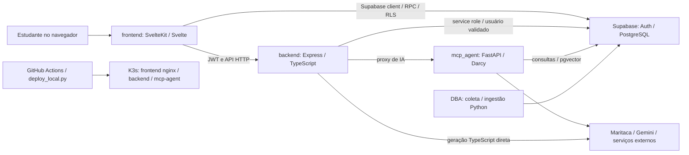

# Projeto, arquitetura e documentação

## Responsabilidade

Integração do mapa de engenharia e governança documental. O produto descrito pela
fonte atende planejamento acadêmico da UnB: catálogo/currículos, histórico, progresso,
equivalências, planejamento e Darcy. `README.md` aponta `no-fluxo.crianex.com`; `AGENTS.md`
foi alinhado a essa referência documental nesta consolidação. Endereços documentados
não constituem verificação de disponibilidade ou versão pública nesta revisão.

## Arquitetura atual revisada

O diagrama representa contratos encontrados na fonte, não conectividade testada.
Detalhes de execução estão nos dossiers de área:

- `frontend/svelte.config.js` usa adapter-static com fallback `index.html`; a raiz
  `frontend/src/routes/+layout.ts` habilita SSR e o grupo protegido o desabilita.
  Hosting estático e configuração SSR de build/dev precisam ser distinguidos.
- `backend/src/index.ts` carrega `.env`, inicializa `SupabaseWrapper`, monta controllers
  e middlewares configurados em `backend/src/config/`. `backend/src/utils.ts`,
  `backend/src/utils/ia_acesso.ts` e controllers fazem autorização por rota.
- `mcp_agent/api_producao.py` expõe FastAPI e recomendação/busca semântica;
  `backend/src/services/chat/orquestrador_agent.ts` coordena os agentes do chat SDK.
  Os serviços de chat legados também permanecem no backend. Não reduzir a implementação atual a RAGFlow.
- `DBA/` reúne coleta/ingestão/parsers; SQL e exports têm datas/limites próprios.
- `.github/workflows/deploy.yml` aguarda CI elegível, publica o SHA do run e chama
  `scripts/deploy/verificar_rollout.py`; manual dispatch tem regra distinta.

O workspace `pnpm-workspace.yaml` inclui frontend/backend/DBA; `package.json` raiz
orquestra scripts por filtro. A inclusão de DBA no workspace não transforma seus
scripts Python em serviço web. READMEs descrevem setup, mas comandos de ingestão
e scraping podem acessar ou alterar serviços externos.

## Documentação: papéis e precedência

| Área | Papel | Limite |
|---|---|---|
| `docs/kb/` | Estado revisado, mapa de contratos, evidência, drift | Fonte e ambiente devem ser conferidos quando mudam |
| `docs/*.md` | Entradas Motor 2/chat/domínio/design e investigação | Entradas atuais roteiam contratos revisados; investigações têm data/escopo próprios |
| `docs/PROJECT_DOCUMENTATION.md` | Router de engenharia | Panorama antigo substituído; fonte LaTeX obsoleta retirada com proveniência Git |
| `documentacao/` + `mkdocs.yml` | Site acadêmico, requisitos, atas, testes | Histórico acadêmico não é estado atual de produção |
| READMEs locais | Setup e introdução por área | Revisados na limpeza; estado externo continua não verificado |
| `kubernetes_docs/` | Referências de infra e procedimentos | Algumas são da plataforma genérica, não do caminho NoFluxo atual |
| `plans/` | README atual; 29 originais retirados | Disposição e recuperação revision:path no ledger; sem instruções antigas na árvore ativa |
| `backend/docs/` + `supabase/migrations/` | Exports e SQL | Não provam aplicação nem schema remoto vigente |

O inventário usa arquivos rastreados; restos locais `no_fluxo_*`, caches, PDFs privados
e artefatos ignorados não definem o produto deste checkout. Recursos móveis de outra
branch não devem ser descritos como presentes aqui. A proposta campus 360 de outra
sessão não está rastreada neste snapshot; nenhuma capacidade 360 é promovida por memória.

## Estado dos planos

`docs/kb/_provenance/plan-disposition.csv` é a fonte de disposição por arquivo.
O README atual aponta a KB. Overview/master e os 27 planos de frente foram retirados
por solicitação explícita do usuário; continuam recuperáveis por revisão/caminho Git.
Disposições da revisão original são evidência histórica de implementação, não instruções
atuais nem aceite de cada checkbox. O manifesto verifica bytes/hashes e destino.
Não foram feitos testes de aceitação de todas as metas nem inspeção da branch mobile.

## Decisões e limites

`PROJECT_WIDE_DECISIONS.md` conserva regras humanas de publicação, segredos e KB.
Os dossiers não fabricam aprovação humana de escolhas encontradas no código.
Guias divergentes foram removidos ou reescritos. Condições reais como SSR de build,
projeção MATR, heurísticas, quotas/embeddings, limites de schema e incerteza externa
continuam descritas nos dossiers. `CLEANUP_AUDIT.md` registra a revisão adicional.

## Evidência e manutenção

Revisão inicial é de código/documentos/Git. Resultados dos checks KB e revisões
independentes ficam em `docs/kb/_provenance/reviews/FINAL_REVIEW.md`. Nenhuma chamada
de IA, ingestão, migration, deploy ou observação de produção foi executada para
consolidar os dossiers. Testes de aplicação citados nas áreas são inventariados, salvo
resultado explicitamente registrado como executado.

Ao alterar contratos, revise dono e consumidores, atualize o inventário se necessário,
execute `kb:check`, veja `kb:drift`, e só então atualize o snapshot depois da revisão
documental. A mudança de protocolo não cria autorização de publicação.

## Rechecagem antes da publicação

A branch foi atualizada para a main de origem `a667757b5c6432718840d6ee0b16939b3c04c83f` antes da PR.
O README mantém a apresentação/GIF/assets adicionados nessa main e recebeu links KB.
A imagem/link GitHub de Vinícius em `documentacao/index.md` acompanha a correção upstream.
Essas referências são documentação/configuração, sem verificação de disponibilidade pública.

## Plano de monitoramento e capacidade

[Plano de 08/10](../../capacity/plano-monitoramento-capacidade-2026-10-08.md)
é a entrada de implementação para a intenção DEC-CAP-002. Inclui LaTeX standalone,
modelo de custo local, inventário agregado e registro de três revisões sequenciais
pelo mesmo agente; não há alegação de revisão independente ou teste da futura
implementação. A auditoria anterior permanece como evidência datada. Os artefatos
em `docs/capacity/` não são documentação pública MkDocs nem mudam comportamento.
